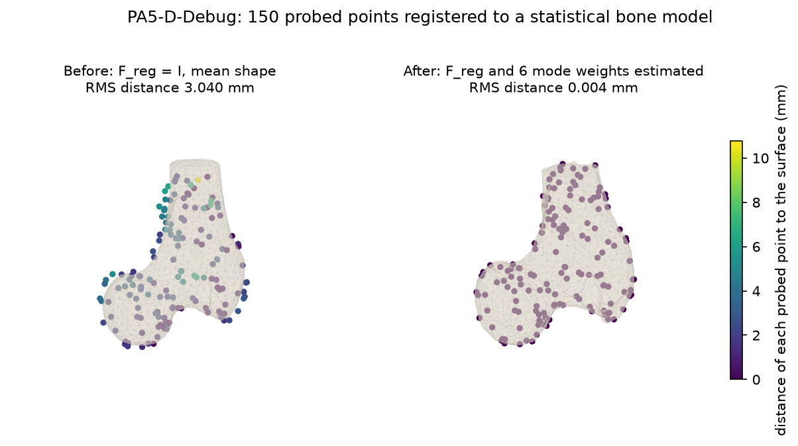
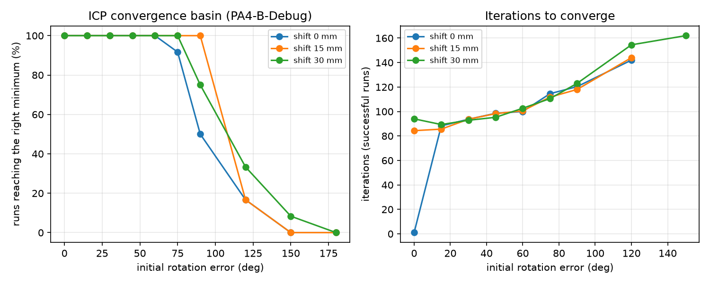

# Surface Registration: ICP and Deformable Registration to a Statistical Shape Model



My implementation of Programming Assignments 3, 4 and 5 from **Computer Integrated Surgery I** at Johns Hopkins University. It registers points touched on a bone with a tracked pointer to a CT-derived bone surface. The progression is: closest points on a triangle mesh, then rigid iterative closest point (ICP), then deformable registration to a statistical shape atlas. Everything is built from scratch in Python and NumPy and validated against the course's reference outputs.

This is the follow-up to [cis-surgical-navigation](https://github.com/mzlumi/cis-surgical-navigation), which covers PA1 and PA2 (frames, point-set registration, pivot calibration, EM distortion correction).

## Summary

- **Closest point on a triangle** by barycentric least squares, with the boundary handled by projecting onto all three edges. A fixed edge rule picks the wrong edge for some obtuse triangles; the tests include such a case.
- **Bounding-box tree** over the 3135 triangles. Its results are identical to brute force on every data set, and it is 20 to 100 times faster for the 75 to 400 points of a data set.
- **Rigid ICP** with a match threshold that shrinks over the iterations and a stopping rule based on how far the last update moved the points. It converges on every set and from initial rotation errors up to about 75 degrees.
- **Deformable registration** (PA5): rigid ICP, then alternating mode-weight and rigid steps, then the handout's linearized combined update with an exact rotation from the small-angle vector.
- **Validation**: all debug sets match the instructor's outputs to the 0.01 mm rounding of the files (noise-free) or to 0.06 mm (noisy). The unknown-set results were committed before the answer key was opened; all of them agree with it to the precision the data allow.

| Assignment | Debug sets: max difference of s_k from the reference | Unknown sets: error of F_reg against the truth |
|---|---|---|
| PA3 | 0.022 mm | (F_reg = I) |
| PA4 | 0.022 mm noise-free, 0.051 mm with 0.1 mm noise | at most 0.005 deg and 0.002 mm noise-free; 0.074 deg and 0.015 mm noisy |
| PA5 | 0.025 mm noise-free, 0.033 mm noisy; weights within 0.05 (noise-free) | at most 0.005 deg and 0.002 mm noise-free; 0.036 deg and 0.017 mm noisy; noise-free weights within 0.1 |

The report is [`report/report.pdf`](report/report.pdf) (7 pages).

## Install and run

Python 3.11 or newer.

```
python -m venv .venv
source .venv/bin/activate
pip install -e ".[dev]"
pytest                                   # about 500 tests, 1 to 2 minutes
```

Run one set or all sets of an assignment. Outputs go to `output/`, per-iteration logs to `results/logs/`, summaries to `results/` and figures to `figures/`:

```
python -m cisreg.pa3 --set A-Debug
python -m cisreg.pa4 --all
python -m cisreg.pa5 --all
```

Use `--data-dir` to point at another copy of the data and `--output-dir` to write elsewhere. Validation and analysis tools:

```
python -m cisreg.validate PA4            # compare with the debug Output and Answer files
python -m cisreg.benchmark               # brute force against the tree
python -m cisreg.analysis                # error analysis figures (about 15 minutes)
python -m cisreg.answer_key              # comparison with the instructor's log files
```

## Results

| Document | Contents |
|---|---|
| [`results/pa3_validation.md`](results/pa3_validation.md) | PA3 against the debug files, and why the remaining 0.01 mm is rounding |
| [`results/search_timing.md`](results/search_timing.md) | Brute force against the bounding-box tree |
| [`results/pa4_validation.md`](results/pa4_validation.md), [`results/pa4_runs.md`](results/pa4_runs.md) | PA4 validation, convergence, F_reg for every set |
| [`results/pa5_validation.md`](results/pa5_validation.md), [`results/pa5_runs.md`](results/pa5_runs.md) | PA5 validation, mode weights and F_reg for every set |
| [`results/answer_key_comparison.md`](results/answer_key_comparison.md) | Unknown sets against the instructor's log files |
| [`results/error_analysis.md`](results/error_analysis.md) | Convergence basin, marker noise, number of modes, timing |
| [`results/comparison_with_public_solutions.md`](results/comparison_with_public_solutions.md) | Public Fall 2025 solutions scored against the same answer key, and what was changed as a result |

PA4 validation against the instructor's Output files (mm; full tables in the files above):

| Sets | max e_s | RMS e_s | F_reg difference |
|---|---|---|---|
| A to D and the four demo sets (noise-free) | 0.014 to 0.022 | 0.007 to 0.009 | at most 0.004 deg, 0.002 mm |
| E and F (0.1 mm marker noise) | 0.051 | 0.021 to 0.024 | 0.02 to 0.03 deg, at most 0.014 mm |

PA5 validation against the instructor's Output files:

| Sets | max e_s (mm) | max weight difference | F_reg difference |
|---|---|---|---|
| A to D (noise-free) | 0.014 to 0.025 | 0.011 to 0.046 | at most 0.0044 deg, 0.0012 mm |
| E and F (0.1 mm marker noise) | 0.028 to 0.033 | 0.20 to 0.34 | at most 0.021 deg, 0.004 mm |

On the noisy sets, and for the PA5 weights, the differences are larger than rounding alone would explain. In every such case our solution has the lower sum of squared distances to the surface, so the instructor's program stopped at a slightly different point. Perturbing the readings at their rounding level moves the PA5 weights by about as much as the observed differences.



## Repository layout

| Path | Contents |
|---|---|
| `src/cisreg/` | The package: readers (`fileio`), frames and registration, `triangle`, `search` (brute force), `boxtree`, `tracking`, `icp`, `shape_model`, `deformable`, the programs `pa3`, `pa4`, `pa5`, and the tools `validate`, `benchmark`, `analysis`, `answer_key`, `plots` |
| `tests/` | pytest suite, run by GitHub Actions on every push |
| `scripts/` | `compare_public_solutions.py`: scores public solutions against the answer key |
| `output/` | Output files for every set, in the handout format |
| `results/`, `figures/` | Validation tables, logs, analysis and figures |
| `report/` | LaTeX source and PDF of the report |
| `data/`, `docs/` | Course data, handouts and the two reference lectures |
| `course-archive/` | Private copy of the course materials |

## The course

**EN.601.455/655 Computer Integrated Surgery I** is taught by Prof. Russell H. Taylor in the Department of Computer Science at Johns Hopkins, through the Laboratory for Computational Sensing and Robotics (LCSR). Taylor led early work on robot-assisted orthopaedic surgery at IBM Research and directed the NSF Engineering Research Center for Computer-Integrated Surgical Systems and Technology (CISST ERC) at Hopkins.

The course covers imaging, segmentation and modeling, frames and calibration, registration, tracking and navigation, and surgical robot systems. Five programming assignments run through one simulated scenario:

| Assignment | Topic | Repository |
|---|---|---|
| PA1 | Frame transformations, point-set registration, pivot calibration | cis-surgical-navigation |
| PA2 | EM distortion correction, EM-to-CT registration, navigation | cis-surgical-navigation |
| **PA3** | Closest point on a triangle mesh (the matching step of ICP) | this one |
| **PA4** | Full rigid ICP registration of probed points to a bone surface | this one |
| **PA5** | Deformable registration to a statistical shape model (optional in the course) | this one |

### Links

- Official course website (EN.601.455/655 Computer Integrated Surgery I): <https://ciis.lcsr.jhu.edu/doku.php?id=courses:455-655:455-655>
- Fall 2025 schedule, with handouts, data and lectures: <https://ciis.lcsr.jhu.edu/doku.php?id=courses:455-655:2025:fall-2025-schedule>
- Prof. Russell H. Taylor, JHU Department of Computer Science faculty page: <https://www.cs.jhu.edu/faculty/russell-taylor/>
- Prof. Taylor's personal academic page: <https://www.cs.jhu.edu/~rht/>
- Laboratory for Computational Sensing and Robotics (LCSR): <https://lcsr.jhu.edu/>
- cisst libraries mentioned in the handouts: <https://github.com/jhu-cisst/cisst>

## The problem

A bone has been scanned with CT, and its surface is given as a triangle mesh. Two optically tracked rigid bodies are used:
- **body B** is screwed into the bone, so it moves with it;
- **body A** is a pointer whose tip touches points on the bone surface.

For each sample k, the poses F_A,k and F_B,k come from point-set registration of the LED readings. The pointer tip in bone-body coordinates is then d_k = F_B,k⁻¹ · F_A,k · A_tip.

- **PA3:** with F_reg = I, find the closest point c_k on the mesh to each s_k = F_reg · d_k. Start with a brute-force search, then add a faster spatial data structure (bounding spheres or a box tree) and check it against the brute force.
- **PA4:** iterate matching and rigid registration (ICP) until F_reg converges, with sensible stopping and outlier handling, and report s_k, c_k and the residuals.
- **PA5:** the bone is no longer fixed. Its shape is the mean shape plus a weighted sum of atlas modes. Estimate F_reg and the mode weights λ together, either by alternating rigid steps and mode steps, or with the linearized combined update described in the handout.

The full statements, file formats and rubrics are in [`docs/handout/`](docs/handout). Two course lectures used as references are in [`docs/reference/`](docs/reference).

## Data and validation

[`data/`](data/README.md) holds the official Fall 2025 data.
- **Debug sets** come with the instructor's outputs and the answers used to generate them.
- **Unknown sets** come without outputs.

The instructor's log files contain the true F_reg and mode weights for every set. They were kept as an answer key: all outputs were validated on the debug sets and committed first, and the comparison with the logs was made afterwards, in a separate commit.

## Status

- [x] Data readers and Cartesian math (frames, rigid point-set registration) with tests
- [x] Closest point on a triangle, brute-force closest point on a mesh
- [x] Fast closest-point search, validated against brute force
- [x] PA3 pipeline and outputs for all sets
- [x] PA4 rigid ICP and outputs for all sets
- [x] PA5 deformable registration and outputs for all sets
- [x] Error analysis and report

## What I learned

The hardest part was knowing when a result was right. Matching the instructor's numbers to the last digit turned out to be the wrong goal: the data files are rounded to 0.01 mm, so two correct programs can only agree to about that level. I learned to work out that floor first, and then to compare solutions by the quantity they minimize rather than by how close they are to a reference. Small geometric details mattered more than I expected: the closest point on an obtuse triangle and the reflection case of the SVD registration both look minor, and both give wrong answers if they are skipped. In PA5, the alternating method was slow because pose and shape pull the points in similar directions. Solving for both together in one linearized step fixed that, which is a lesson I expect to use again in robotics and biomechanics problems where several kinds of unknowns are coupled.

## Comparison with other public solutions

After all results were final, I compared them with public solutions to the same Fall 2025 assignments ([details](results/comparison_with_public_solutions.md), reproducible with `python scripts/compare_public_solutions.py`). Scored against the same answer key, our F_reg has the lowest sum of squared surface distances on every PA4 and PA5 unknown set, and our PA5 noise-free weights are 10 to 22 times closer to the truth than the only other published PA5 outputs. The comparison also found that a vertex-based KD-tree in one solution misses the true closest point by up to 1.1 mm, a failure mode our exact-equality tests rule out.

Two ideas from the other repositories were tested in this code: an oriented-box (covariance) tree, which gives tighter boxes but no speedup on this mesh and is kept as an option, and, prompted by that experiment, a tighter seed bound for searches without a hint, which cuts the triangle tests for those searches by about a third. No code from these repositories was copied (they carry no license).

## Credit

The problem, the handouts, the lecture notes and the data are by Russell H. Taylor and the CIS I teaching staff at Johns Hopkins University. They are included here for reference only. The code here was written for this project from the handouts; no code from other students' solutions was used.

Public solutions consulted for the comparison above, with thanks to their authors:

- [SeanSDarcy2001/CISProgrammingAssignments](https://github.com/SeanSDarcy2001/CISProgrammingAssignments) (Fall 2021): its covariance tree prompted the oriented-box option and the tighter seed bound in [`src/cisreg/boxtree.py`](src/cisreg/boxtree.py). It builds on the course template [benjamindkilleen/ciscode](https://github.com/benjamindkilleen/ciscode) by Benjamin D. Killeen.
- [mayasharma604/CIS-PA3](https://github.com/mayasharma604/CIS-PA3), [CIS-PA4](https://github.com/mayasharma604/CIS-PA4) and [CIS-PA5](https://github.com/mayasharma604/CIS-PA5) by Maya Sharma and Anishka Bhartiya (Fall 2025).
- [pranhav16/CIS_PA4](https://github.com/pranhav16/CIS_PA4) by Luiza Brunelli and Pranhav Sundararajan (Fall 2025).
- [vibhakamath23/CIS-PA3](https://github.com/vibhakamath23/CIS-PA3) (Fall 2025).
- [SIDR73/cis2025](https://github.com/SIDR73/cis2025) (Fall 2025).
- [suryanshshukla10/CIS-PA4](https://github.com/suryanshshukla10/CIS-PA4) and [CIS-PA5](https://github.com/suryanshshukla10/CIS-PA5) (Fall 2021).
