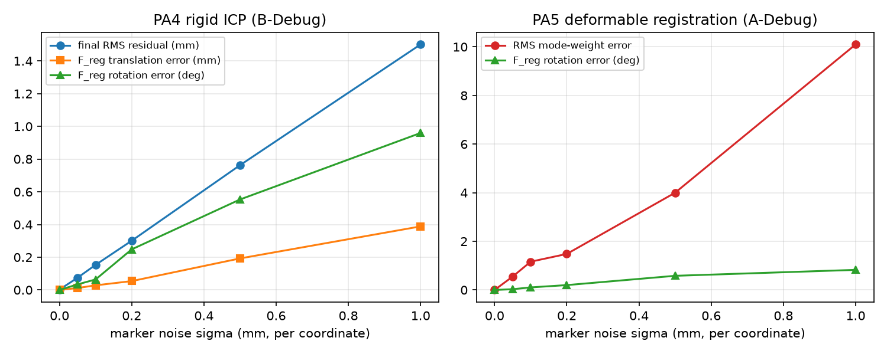
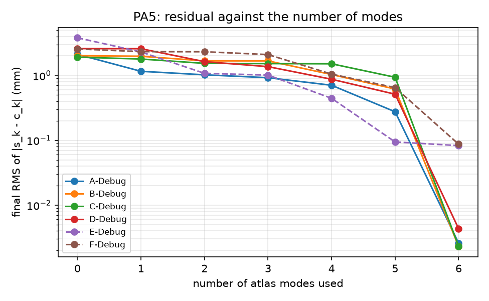
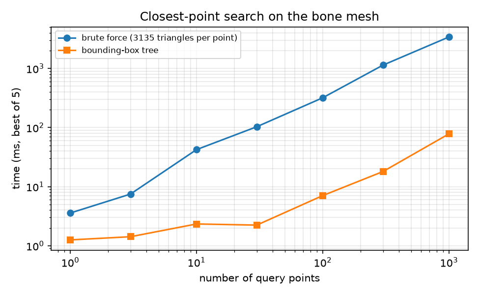

# Error analysis

Four experiments probe how the methods behave beyond the given data sets. They are run by

```
python -m cisreg.analysis
```

which writes the figures in `figures/` and the numbers in [`error_analysis_data.md`](error_analysis_data.md). All experiments use fixed random seeds. The reference answers are our own noise-free solutions on the debug sets, so none of this uses the answer key.

## 1. ICP convergence basin


Setup: PA4-B-Debug (200 samples). Starting from our converged F_reg, the initial guess is misaligned by a rotation of a given angle about a random axis through the centroid of the sample points, followed by a shift of 0, 15 or 30 mm in a random direction. ICP (default options, at most 300 iterations) then runs from that guess. A run counts as a success if it ends within 0.1 degrees and 0.1 mm of the reference; 12 random trials per cell.

| Initial rotation | 0 to 60 deg | 75 deg | 90 deg | 120 deg | 150 deg | 180 deg |
|---|---|---|---|---|---|---|
| Success rate (all shifts) | 100% | 92 to 100% | 50 to 100% | 17 to 33% | 0 to 8% | 0% |

ICP reaches the right minimum from every start up to 60 degrees and 30 mm, and from almost every start at 75 degrees. Beyond 90 degrees it usually ends in a different local minimum. A wide basin is plausible here because the 200 samples cover much of the bone and the bone (about 85 x 60 x 114 mm) is far from symmetric. Within this range the shift has little systematic effect; the differences between the three curves at 90 to 150 degrees are within the scatter of 12 trials. The number of iterations grows steadily with the initial error, from about 85 at small angles to about 160 at 120 degrees, because ICP converges linearly. The course data start within 3.5 degrees and 6 mm of the solution, deep inside the basin, so a rough initial alignment (for example from a few anatomical landmarks) is all a clinical system would need.

## 2. Marker noise



Setup: Gaussian noise with standard deviation sigma (per coordinate) is added to every LED reading of a debug set, and the whole pipeline (poses, pointer tips, registration) is run again. Errors are measured against the noise-free solution; 10 trials per level for PA4-B-Debug and 4 for PA5-A-Debug.

| sigma (mm) | 0.05 | 0.1 | 0.2 | 0.5 | 1.0 |
|---|---|---|---|---|---|
| PA4 rotation error (deg) | 0.034 | 0.064 | 0.25 | 0.55 | 0.96 |
| PA4 translation error (mm) | 0.012 | 0.028 | 0.054 | 0.19 | 0.39 |
| PA4 final RMS residual (mm) | 0.075 | 0.15 | 0.30 | 0.76 | 1.50 |
| PA5 RMS weight error | 0.55 | 1.16 | 1.48 | 4.0 | 10.1 |
| PA5 rotation error (deg) | 0.030 | 0.11 | 0.20 | 0.58 | 0.83 |

All errors grow roughly in proportion to sigma, as expected for a least-squares estimate with small noise.

- The final residual is about 1.5 sigma. Each pointer tip is computed from two noisy poses, and the tip is 100 mm from the pointer's markers, so a small rotation error of body A or B is amplified at the tip. The residual measures the part of the tip error that is normal to the surface.
- The F_reg error is much smaller than the residual because it averages over 200 samples: at the course noise level (0.1 mm) the rotation is good to about 0.06 degrees and the translation to about 0.03 mm, which matches the size of the differences between our F_reg and the instructor's on the noisy debug sets.
- The mode weights are far more sensitive: about 10 units of RMS weight error per mm of noise. A unit-norm mode moves a vertex by at most 0.09 mm per unit weight, so a weight error of 1 corresponds to a shape change of a few hundredths of a millimetre, which is easily hidden by 0.1 mm noise. With 150 samples the expected weight error at sigma = 0.1 mm is about 1.2; scaling by sqrt(150/400) for the 400-sample sets E, F, H and J gives about 0.7, in line with the weight errors of 0.17 to 0.54 (RMS) found for those sets.

## 3. Number of modes



Setup: PA5 debug sets solved with only the first M atlas modes (M = 0 is rigid ICP to the mean shape).

| Set | M = 0 | M = 3 | M = 5 | M = 6 |
|---|---|---|---|---|
| A-Debug | 2.12 | 0.92 | 0.28 | 0.0026 |
| C-Debug | 1.91 | 1.52 | 0.94 | 0.0023 |
| E-Debug (noisy) | 3.81 | 1.01 | 0.094 | 0.083 |
| F-Debug (noisy) | 2.56 | 2.10 | 0.65 | 0.087 |

(RMS residual in mm; all M in `error_analysis_data.md`.) The rigid fit to the mean shape leaves residuals of about 2 to 4 mm, so the deformation matters. The residual falls as modes are added, but the noise-free sets only reach the rounding floor (about 0.003 mm) with all 6 modes, because their shapes were generated with large weights on every mode: leaving out even mode 6 leaves 0.3 to 0.9 mm. E-Debug is the exception: its sixth weight is small (about -3.4), so 5 modes already reach its noise floor of about 0.09 mm. Modes are not ordered by their importance for a given bone; a mode with a small variance in the population can still carry a large weight for one patient. Using fewer modes than the data need would bias the shape and, through the coupling between shape and pose, the registration.

## 4. Search time



Setup: random points in the bounding box of the bone (enlarged by 5 mm), best of 5 runs.

| N | 1 | 10 | 100 | 1000 |
|---|---|---|---|---|
| Brute force (ms) | 3.6 | 42 | 319 | 3406 |
| Tree (ms) | 1.3 | 2.3 | 7.1 | 78 |
| Speedup | 2.8 | 18 | 45 | 44 |

Brute force grows linearly with N (3135 triangle tests per point). The tree's cost per point is much lower (about 50 triangle tests, see `search_timing.md`), but it has a fixed overhead of about 1 ms of NumPy calls per query batch, which dominates for small batches. The machine was heavily loaded by other processes during this run, so individual times are noisy (for example brute force at N = 10); the trends and the 20 to 100 fold speedups for the batch sizes used by PA4 and PA5 (75 to 400 points) agree with the separate benchmark in `search_timing.md`. In ICP the tree is also seeded with the previous match, which tightens the bound further.

## Summary

- ICP converges from initial rotation errors up to about 75 degrees on this bone, far beyond the misalignment in the course data.
- At 0.1 mm marker noise, F_reg is determined to about 0.06 degrees and 0.03 mm, while the mode weights are only determined to about 1 unit with 150 samples. The weights are the least certain output of the whole pipeline.
- All 6 modes are needed for the noise-free PA5 sets; each missing mode leaves residuals of tenths of a millimetre.
- The bounding-box tree is 20 to 100 times faster than brute force for the batch sizes used, with identical results.
