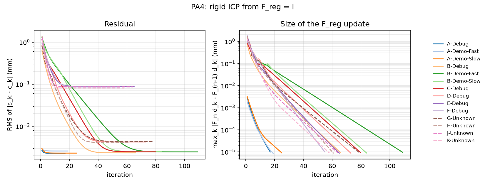

# PA4 validation on the debug and demo sets

Our outputs in `output/` are compared with the instructor's `PA4-X-Output.txt` and `PA4-X-Answer.txt` files for the six debug sets and the four demo sets. The tables are printed by

```
python -m cisreg.pa4 --all
python -m cisreg.validate PA4
```

Every run starts from F_reg = I, uses the bounding-box tree for matching and the default ICP options (`cisreg.icp.IcpOptions`). Per-set iteration counts, final residuals and the estimated F_reg are in [`pa4_runs.md`](pa4_runs.md), and the per-iteration logs are in [`logs/`](logs).

## Error measures

As for PA3, with our s_k, c_k and the reference s'_k, c'_k (all in mm):
e_s,k = |s_k - s'_k|, e_c,k = |c_k - c'_k|, e_dist,k = | |s_k - c_k| - |s'_k - c'_k| |, reported as the maximum over the set and RMS = sqrt(mean_k e_k^2).

## Point-wise comparison

Against the Output files:

| Set | N | max e_s | RMS e_s | max e_c | RMS e_c | max e_dist |
|---|---|---|---|---|---|---|
| A-Debug | 75 | 0.0141 | 0.0073 | 0.0141 | 0.0062 | 0.0060 |
| A-Demo-Fast | 75 | 0.0141 | 0.0083 | 0.0141 | 0.0067 | 0.0080 |
| A-Demo-Slow | 75 | 0.0141 | 0.0072 | 0.0141 | 0.0066 | 0.0060 |
| B-Debug | 200 | 0.0141 | 0.0072 | 0.0141 | 0.0061 | 0.0060 |
| B-Demo-Fast | 75 | 0.0141 | 0.0082 | 0.0141 | 0.0069 | 0.0060 |
| B-Demo-Slow | 75 | 0.0141 | 0.0080 | 0.0141 | 0.0063 | 0.0070 |
| C-Debug | 200 | 0.0141 | 0.0073 | 0.0173 | 0.0072 | 0.0060 |
| D-Debug | 200 | 0.0224 | 0.0090 | 0.0173 | 0.0079 | 0.0140 |
| E-Debug | 200 | 0.0510 | 0.0237 | 0.0510 | 0.0206 | 0.0400 |
| F-Debug | 200 | 0.0510 | 0.0205 | 0.0447 | 0.0175 | 0.0330 |

Against the Answer files (the values used to generate the data):

| Set | N | max e_s | RMS e_s | max e_c | RMS e_c | max e_dist |
|---|---|---|---|---|---|---|
| A-Debug | 75 | 0.0141 | 0.0073 | 0.0141 | 0.0062 | 0.0060 |
| A-Demo-Fast | 75 | 0.0141 | 0.0083 | 0.0141 | 0.0067 | 0.0080 |
| A-Demo-Slow | 75 | 0.0141 | 0.0072 | 0.0141 | 0.0066 | 0.0060 |
| B-Debug | 200 | 0.0141 | 0.0072 | 0.0141 | 0.0061 | 0.0060 |
| B-Demo-Fast | 75 | 0.0141 | 0.0083 | 0.0141 | 0.0068 | 0.0060 |
| B-Demo-Slow | 75 | 0.0141 | 0.0079 | 0.0141 | 0.0062 | 0.0070 |
| C-Debug | 200 | 0.0141 | 0.0074 | 0.0173 | 0.0071 | 0.0060 |
| D-Debug | 200 | 0.0224 | 0.0090 | 0.0173 | 0.0079 | 0.0140 |
| E-Debug | 200 | 0.0424 | 0.0238 | 0.0412 | 0.0200 | 0.0350 |
| F-Debug | 200 | 0.0608 | 0.0262 | 0.0616 | 0.0234 | 0.0370 |

The eight noise-free sets (A to D, including the demo sets) agree to 0.022 mm at most, with RMS 0.007 to 0.009 mm. As shown for PA3 in [`pa3_validation.md`](pa3_validation.md), this is the level expected from the 0.01 mm rounding of the input readings and of both output files.

## Registration frames

The output files do not list F_reg, but s_k = F_reg d_k with known d_k, so F_reg can be recovered from any output file by registering our d_k onto its s_k. The table compares the frame recovered from our file (F) with the one recovered from the instructor's file (F'), and scores both with the ICP objective, SSE = sum_k dist(F d_k, surface)^2 in mm^2.

| Set | angle(F^-1 F') (deg) | abs(p - p') (mm) | SSE with our F | SSE with reference F' |
|---|---|---|---|---|
| A-Debug | 0.0012 | 0.0005 | 0.0004 | 0.0004 |
| A-Demo-Fast | 0.0022 | 0.0010 | 0.0005 | 0.0005 |
| A-Demo-Slow | 0.0022 | 0.0012 | 0.0004 | 0.0004 |
| B-Debug | 0.0023 | 0.0011 | 0.0012 | 0.0011 |
| B-Demo-Fast | 0.0042 | 0.0015 | 0.0005 | 0.0005 |
| B-Demo-Slow | 0.0013 | 0.0006 | 0.0005 | 0.0005 |
| C-Debug | 0.0003 | 0.0003 | 0.0013 | 0.0012 |
| D-Debug | 0.0024 | 0.0003 | 0.0036 | 0.0036 |
| E-Debug | 0.0307 | 0.0144 | 1.5782 | 1.6017 |
| F-Debug | 0.0233 | 0.0100 | 1.4772 | 1.4975 |

On the noise-free sets the two frames agree to within 0.005 degrees and 0.002 mm, and fit equally well.

## The noisy sets E and F

E and F have 0.1 mm marker noise, and here our points differ from the instructor's by up to 0.06 mm (RMS about 0.02 mm), more than rounding explains. The frame table shows why: our F_reg and the instructor's differ by about 0.03 degrees and 0.01 mm, and ours has the lower sum of squared distances (1.578 against 1.602 mm^2 for E, 1.477 against 1.498 for F). Our ICP stopped only when an update moved every point by less than 1e-5 mm, so it is at a fixed point of the matching and registration steps. The instructor's program evidently stopped at a slightly different point, perhaps from a looser stopping rule or a different weighting of pairs; the handout does not say. I did not tune the options toward the reference files.

With noise, neither answer reproduces the Answer file exactly. The final RMS residuals (0.089 mm for E, 0.086 mm for F, in `pa4_runs.md`) are the scale of the noise propagated to the pointer tip, compared with about 0.0025 mm on the noise-free sets.

## Outlier rejection

The match threshold eta is infinite for the first 3 iterations and then shrinks to max(0.5 mm, 3 x mean residual). On these sets it removes up to 13 of 200 pairs in some early iterations, when the residuals are still large, but none at the end. Running every set with `--no-outlier-rejection` gives identical output files except for one coordinate of one line of G-Unknown that changes in its last rounded digit. The data contain no gross outliers. With gross outliers it does matter. In the synthetic setting of `tests/test_icp.py` (200 surface points with 0.1 mm noise, 10% of them moved 8 to 15 mm off the surface), four trials gave F_reg rotation errors of 0.3 to 1.3 degrees without rejection and 0.06 to 0.16 degrees with it.

## Convergence



All 14 runs stop on the motion criterion, in 17 to 109 iterations. The right panel shows linear convergence: each update is a roughly constant fraction of the previous one, as is typical for ICP near the minimum. The residual (left) levels off at about 0.0025 mm for the noise-free sets and about 0.085 mm for the noisy ones. The A sets start at F_reg = I (residual already 0.003 mm), while the others start with misalignments of up to about 3.4 degrees and 3.7 mm. The B-Demo-Fast set is the slowest to converge here; its initial misalignment is a pure translation of about (1, 2, 3) mm, which ICP corrects in many small steps along the bone. Each run takes well under a second with the tree (about 3.8 s for all 14 sets).

## Summary

The noise-free debug and demo sets match the reference outputs to the rounding level. The noisy sets match to 0.06 mm, and on those our registration fits the surface slightly better than the reference. There is no sign of a systematic error.
