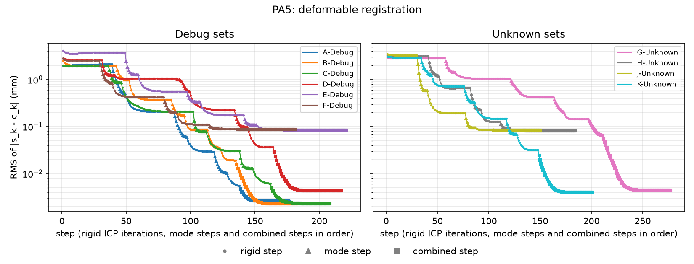

# PA5 validation on the debug sets

Our outputs in `output/` are compared with the instructor's `PA5-X-Debug-Output.txt` and `PA5-X-Debug-Answer.txt` files. The tables are printed by

```
python -m cisreg.pa5 --all
python -m cisreg.validate PA5 --rounding-sets A-Debug D-Debug --rounding-trials 10
```

Every run uses the default `cisreg.deformable.DeformableOptions`: rigid ICP to the mean shape, 3 rounds of alternation (up to 10 mode-weight steps, then rigid ICP), then linearized combined steps until an update moves every sample and every vertex by less than 1e-5 mm. Step counts, residuals, weights and F_reg for every set are in [`pa5_runs.md`](pa5_runs.md), and per-step logs are in [`logs/`](logs). All sets use 6 modes, as their sample headers specify.

## Error measures

As for PA3 and PA4: e_s,k = |s_k - s'_k|, e_c,k = |c_k - c'_k| and e_dist,k = | |s_k - c_k| - |s'_k - c'_k| |, in mm, reported as the maximum over a set and RMS = sqrt(mean_k e_k^2). The weight column is max_m |lambda_m - lambda'_m|. The c_k lie on our deformed surface and the c'_k on the instructor's.

## Point-wise comparison

Against the Output files:

| Set | N | max e_s | RMS e_s | max e_c | RMS e_c | max e_dist | max weight diff |
|---|---|---|---|---|---|---|---|
| A-Debug | 150 | 0.0141 | 0.0082 | 0.0173 | 0.0072 | 0.0070 | 0.0112 |
| B-Debug | 150 | 0.0141 | 0.0075 | 0.0141 | 0.0062 | 0.0070 | 0.0269 |
| C-Debug | 150 | 0.0141 | 0.0078 | 0.0141 | 0.0071 | 0.0060 | 0.0233 |
| D-Debug | 150 | 0.0245 | 0.0102 | 0.0245 | 0.0092 | 0.0150 | 0.0464 |
| E-Debug | 400 | 0.0283 | 0.0116 | 0.0245 | 0.0120 | 0.0290 | 0.3351 |
| F-Debug | 400 | 0.0332 | 0.0140 | 0.0245 | 0.0133 | 0.0270 | 0.1951 |

Against the Answer files:

| Set | N | max e_s | RMS e_s | max e_c | RMS e_c | max e_dist | max weight diff |
|---|---|---|---|---|---|---|---|
| A-Debug | 150 | 0.0141 | 0.0082 | 0.0173 | 0.0072 | 0.0070 | 0.0114 |
| B-Debug | 150 | 0.0141 | 0.0075 | 0.0141 | 0.0062 | 0.0070 | 0.0274 |
| C-Debug | 150 | 0.0141 | 0.0078 | 0.0141 | 0.0071 | 0.0060 | 0.0248 |
| D-Debug | 150 | 0.0245 | 0.0102 | 0.0245 | 0.0092 | 0.0150 | 0.0460 |
| E-Debug | 400 | 0.0700 | 0.0380 | 0.0837 | 0.0380 | 0.0550 | 0.9118 |
| F-Debug | 400 | 0.0583 | 0.0285 | 0.0707 | 0.0270 | 0.0540 | 0.2889 |

The sample points and closest points agree with the instructor's to 0.025 mm on the noise-free sets A to D and to 0.033 mm on the noisy sets E and F. The RMS differences on A to D (0.006 to 0.010 mm) are at the rounding level found for PA3.

## Registration frames

As for PA4, F_reg is recovered from each file by registering our d_k onto its s_k. Each frame is scored by the sum of squared distances from F d_k to the surface deformed with the weights from the same file (SSE, mm^2).

| Set | angle(F^-1 F') (deg) | abs(p - p') (mm) | SSE with our F and weights | SSE with reference F' and weights |
|---|---|---|---|---|
| A-Debug | 0.0044 | 0.0005 | 0.0010 | 0.0011 |
| B-Debug | 0.0013 | 0.0004 | 0.0008 | 0.0009 |
| C-Debug | 0.0040 | 0.0006 | 0.0008 | 0.0009 |
| D-Debug | 0.0025 | 0.0012 | 0.0028 | 0.0032 |
| E-Debug | 0.0077 | 0.0042 | 2.7369 | 2.7550 |
| F-Debug | 0.0208 | 0.0015 | 3.0204 | 3.0327 |

The frames agree to 0.02 degrees and 0.005 mm. On every set our pose and shape fit the data at least as well as the instructor's.

## Mode weights

| Set | max abs(ours - Output) | max abs(ours - Answer) | max abs(Output - Answer) |
|---|---|---|---|
| A-Debug | 0.0112 | 0.0114 | 0.0014 |
| B-Debug | 0.0269 | 0.0274 | 0.0009 |
| C-Debug | 0.0233 | 0.0248 | 0.0015 |
| D-Debug | 0.0464 | 0.0460 | 0.0016 |
| E-Debug | 0.3351 | 0.9118 | 0.7538 |
| F-Debug | 0.1951 | 0.2889 | 0.3498 |

The weights are of order 10 to 180, so on the noise-free sets they agree to about 1 part in 3000. They do not agree as closely as the instructor's Output agrees with the Answer (0.001 to 0.002). The reason is the precision of the input data rather than the algorithm:

- The modes are orthonormal over all 4704 vertex coordinates, and no mode moves any vertex by more than 0.09 mm per unit weight. A change of 0.03 in one weight therefore moves a vertex by at most 0.003 mm, well below the 0.01 mm rounding of the input readings. The weights are therefore only determined to a few hundredths by the rounded data.
- Rounding-level test: adding uniform noise of plus or minus 0.005 mm to every reading and solving again (10 trials) moves the weights by a standard deviation of 0.014 to 0.041 for A-Debug (largest change 0.078) and 0.014 to 0.033 for D-Debug (largest change 0.067). Our differences from the reference (0.011 to 0.046) are within this spread.
- The instructor's Output is much closer to the Answer than this spread allows, which is consistent with the PA3 finding that the instructor's program worked from unrounded readings.
- Our solution has a lower SSE than the instructor's on every set (frame table), so it is a slightly better fit to the rounded data that we were given. Running the alternation to full convergence, or skipping it and using only combined steps, gives the same weights to within 0.001, so the result does not depend on the order of the steps.

On the noisy sets E and F (0.1 mm marker noise), neither program recovers the Answer weights closely: ours differ by up to 0.91 and the instructor's by up to 0.75. With noise of 0.1 mm against modes that move vertices by at most 0.09 mm per unit weight, weight errors of a fraction of a unit are expected; the two programs differ from each other by 0.20 to 0.34.

## Convergence



The plot shows the RMS residual after every step, in order. Each rigid ICP phase quickly finds the best pose for the current shape and then levels off (dots on a plateau). Each mode step changes the shape, and the residual drops sharply (triangles). The alternation reduces the residual by about two orders of magnitude, but every round of 10 mode steps stops at the cap, without the weights settling to 1e-5. The combined steps (squares) then finish: they converge linearly to the floor of about 0.002 to 0.004 mm on the noise-free sets and 0.08 to 0.09 mm on the noisy ones. Every set converged.

Running the alternation alone to convergence took about 250 mode steps and 280 rigid iterations per set, because a rigid motion and a mode can move the points in similar directions and the two separate steps then make slow, zigzag progress. The combined step solves for both together. With the defaults, each set takes 1.5 to 4 seconds.

## The handout's equation 7

The handout writes the combined step as s_k x alpha - epsilon + sum_m lambda_m^(t+1) q_m,k ~ s_k - c_k. Since c_k = q_0,k + sum_m lambda_m^(t) q_m,k already includes the current weights, the unknowns in this equation must be the weight changes lambda^(t+1) - lambda^(t), otherwise the current deformation is counted twice. The code solves for the changes (`cisreg.deformable.solve_combined_step`), and `tests/test_deformable.py` checks that one step recovers a known small rotation, translation and weight change.

## Summary

The debug sets match the reference outputs to 0.03 mm in the points and 0.02 degrees in F_reg. The weights match to 0.05 on the noise-free sets and to 0.34 on the noisy sets. These differences are explained by the rounding of the inputs and the measurement noise, and our fits have the lower residual. There is no sign of a systematic error.
